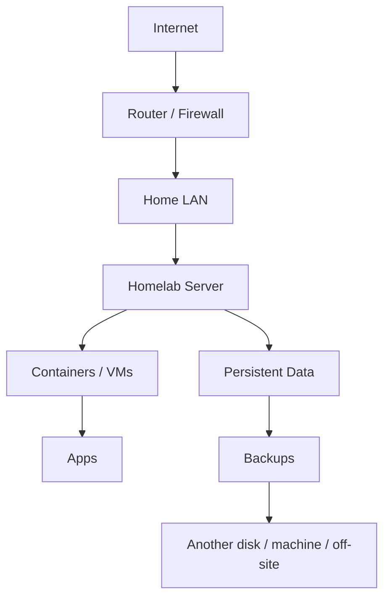
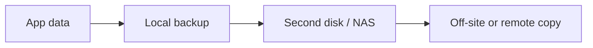

<div align="center">

# 🧰 Homelab From Zero

### From “I have an old PC” to a useful, backed-up, remotely accessible home server.

No rack required. No Kubernetes required. No 40-container flex on day one.

[](#)
[](DOCKER-STARTER.md)
[](NETWORKING-AND-REMOTE-ACCESS.md)
[](#)

### [🚀 Start the roadmap](#-the-roadmap) · [🐳 Docker](DOCKER-STARTER.md) · [🌐 Networking](NETWORKING-AND-REMOTE-ACCESS.md) · [💾 Backups](BACKUPS-AND-SECURITY.md)

</div>

---

## 🎯 What this guide is trying to prevent

A first homelab should not look like this:

```text
Day 1: install Proxmox, Kubernetes, 28 containers and a dashboard
Day 2: forward random ports
Day 7: forget where persistent data lives
Month 2: disk dies
```

This guide builds the boring foundation first — because boring infrastructure is what lets the fun stuff survive.

<table>
<tr>
<td width="33%" valign="top">

### 🧱 Understandable
Use technology you can explain and recover yourself.

</td>
<td width="33%" valign="top">

### 🔐 Private first
Remote access should default to VPN-style access, not public exposure.

</td>
<td width="33%" valign="top">

### 💾 Recoverable
A service is not important until you know how to restore it.

</td>
</tr>
</table>

---

## 🧠 The simplest mental model



If Mermaid does not render, remember this chain:

**Internet → router → LAN → server → apps + persistent data → backups**

---

## 🧭 Choose your starting platform

| Your situation | Good starting point | Why |
|---|---|---|
| 🖥 One old PC, want simplicity | **Debian / Ubuntu Server + Docker Compose** | Easy to understand and document |
| 🧪 Want VMs/LXCs and lab experiments | **Proxmox VE** | Great virtualization-first base |
| 💽 Storage-first build | **NAS-oriented platform you understand** | Keeps storage architecture central |
| 🍓 Raspberry Pi / small ARM box | **Linux + Docker/Podman** | Lightweight and efficient |

> For many beginners, plain Linux + Docker Compose is easier to learn than adding a hypervisor immediately.

### 👉 [Hardware and architecture guide →](HARDWARE-AND-ARCHITECTURE.md)

---

# 🚀 The Roadmap

## 1️⃣ Hardware first

Start with what you already have whenever practical:

- old desktop
- mini PC
- laptop
- used office PC
- small server
- Pi-class ARM device

Do not buy rack gear just because homelab photos look cool.

**Read:** [HARDWARE-AND-ARCHITECTURE.md](HARDWARE-AND-ARCHITECTURE.md)

---

## 2️⃣ Install the base OS

A simple first server usually needs:

```text
Linux server
├─ normal admin user
├─ SSH
├─ predictable LAN IP / DHCP reservation
└─ updates + basic firewall awareness
```

If you want a virtualization-first lab, Proxmox can be the better base.

---

## 3️⃣ Learn only the networking you actually need

You do not need to become a network engineer before hosting your first app.

Learn these first:

| Concept | What it means for your homelab |
|---|---|
| **LAN IP** | Where your server lives inside your home network |
| **DHCP reservation** | Keeps the server at a predictable address |
| **DNS** | Turns names into addresses |
| **Port** | Where a service listens |
| **Gateway/router** | Path out of your LAN |
| **Private vs public access** | Determines whether the internet can reach the service |

**Read:** [NETWORKING-AND-REMOTE-ACCESS.md](NETWORKING-AND-REMOTE-ACCESS.md)

---

## 4️⃣ Run your first container

Use Docker Compose so your deployment is written down instead of living only in your shell history.

```yaml
services:
  example:
    image: example/image:latest
    restart: unless-stopped
    ports:
      - "8080:8080"
    volumes:
      - ./data:/data
```

The important idea is not the example app — it is that **config and persistent storage are explicit**.

**Read:** [DOCKER-STARTER.md](DOCKER-STARTER.md)

---

## 5️⃣ Install one useful service

Do not start with 20 apps. Start with something that gives the server a reason to exist.

| Goal | Good first service |
|---|---|
| 📡 Learn monitoring | **Uptime Kuma / Gatus** |
| 🎬 Personal media | **Jellyfin** |
| 🌐 DNS filtering | **AdGuard Home / Pi-hole** |
| 🔄 File synchronization | **Syncthing** |
| 🍲 Recipes | **Mealie** |
| 📰 RSS | **Miniflux / FreshRSS** |

For more carefully selected apps: **[selfhosted-picks →](https://github.com/ish4ra/selfhosted-picks)**

---

## 6️⃣ Back up before you expand

This is the part beginners most often postpone.

> A Docker Compose file is **not** a backup of the database, uploads, config and application state inside your service.

A healthier pattern:



At minimum, know:

- what data matters;
- where it lives;
- how often it is backed up;
- how to restore it;
- whether you have actually tested that restore.

**Read:** [BACKUPS-AND-SECURITY.md](BACKUPS-AND-SECURITY.md)

---

## 7️⃣ Add remote access safely

### Preferred order

```text
Local-only
   ↓
Private VPN-style access
   ↓
Reverse proxy + HTTPS only when public access is actually needed
```

For private remote access, WireGuard/Tailscale-style networking is often a better first step than forwarding ports to individual apps.

**Read:** [NETWORKING-AND-REMOTE-ACCESS.md](NETWORKING-AND-REMOTE-ACCESS.md)

---

## 📅 A good first month

| Week | Target |
|---|---|
| **Week 1** | Base OS, SSH, predictable LAN IP |
| **Week 2** | Docker Compose + one useful app + monitoring |
| **Week 3** | Backup job + restore test + private remote access |
| **Week 4** | Add only the services you now have a real reason to run |

That is enough for a real homelab.

---

## ⭐ Strong beginner stack

| Layer | Recommended starting point |
|---|---|
| 🐧 Base OS | **Debian / Ubuntu Server** |
| 🐳 Containers | **Docker Compose** |
| 🔐 Private remote access | **WireGuard / Tailscale** |
| 🌍 Reverse proxy | **Caddy** |
| 📡 Monitoring | **Uptime Kuma / Gatus / Beszel** |
| 🌐 DNS | **AdGuard Home / Pi-hole** |
| 💾 Backup tooling | **Restic / Kopia + separate target** |
| 🎬 Media | **Jellyfin** |
| 📷 Photos | **Immich** — after you understand storage/backups |

---

## 🚫 Common beginner traps

<table>
<tr>
<td width="50%" valign="top">

### Avoid

- Port-forwarding every dashboard
- Exposing Docker socket casually
- Running databases with no persistence plan
- Keeping the only backup on the same disk
- Copying giant Compose stacks blindly
- Treating RAID as a backup

</td>
<td width="50%" valign="top">

### Prefer

- Private access first
- Explicit volumes and data paths
- Small Compose files you understand
- Another backup target
- Restore testing
- One app at a time

</td>
</tr>
</table>

---

## 🗂 Guide map

| Guide | What it covers |
|---|---|
| **[HARDWARE-AND-ARCHITECTURE.md](HARDWARE-AND-ARCHITECTURE.md)** | Old PCs, mini PCs, storage and Linux vs Proxmox decisions |
| **[NETWORKING-AND-REMOTE-ACCESS.md](NETWORKING-AND-REMOTE-ACCESS.md)** | LAN, DNS, ports, VPNs, reverse proxy and exposure |
| **[DOCKER-STARTER.md](DOCKER-STARTER.md)** | Docker Compose basics and persistent storage |
| **[BACKUPS-AND-SECURITY.md](BACKUPS-AND-SECURITY.md)** | Backup strategy, restore thinking and safer operations |

---

## 🔗 Build out the rest of the stack

<table>
<tr>
<td width="50%" valign="top">

### 🏠 [Selfhosted Picks](https://github.com/ish4ra/selfhosted-picks)
A curated shortlist of services worth running once the infrastructure is ready.

</td>
<td width="50%" valign="top">

### 🎬 [Jellyfin Media Server Guide](https://github.com/ish4ra/jellyfin-media-server-guide)
A focused media-server guide covering clients, plugins, transcoding and remote access.

</td>
</tr>
<tr>
<td width="50%" valign="top">

### 🌱 [Open Source Alternatives](https://github.com/ish4ra/open-source-alternatives)
Find open alternatives across desktop, web, self-hosted and privacy-friendly software.

</td>
<td width="50%" valign="top">

### 📱 [Android FOSS Starter Kit](https://github.com/ish4ra/android-foss-starter-kit)
Build a cleaner Android setup with FOSS apps, alternative app sources and LineageOS.

</td>
</tr>
</table>

---

<div align="center">

## 🧱 Build boring foundations. Then build cool things on top.

A good homelab is not the one with the most containers — it is the one you can understand, update, back up and recover.

### If this guide saved you from a painful first-server mistake, a ⭐ helps another beginner find it.

</div>